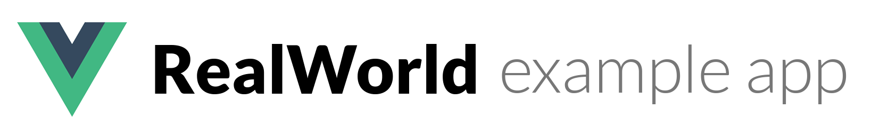

# 

This codebase was created to demonstrate a fully fledged fullstack application built with **Vue.js** including CRUD operations, authentication, routing, pagination, and more.


## Getting started

The stack is built using [vue-cli webpack](https://github.com/vuejs-templates/webpack) so to get started all you have to do is:

``` bash
# install dependencies
> yarn install
# serve with hot reload at localhost:8080
> yarn serve
```

Other commands available are:

``` bash
# build for production with minification
yarn run build

# run unit tests
yarn test
```

## To know

Current arbitrary choices are:

- Vuex modules for store
- Vue-axios for ajax requests
- 'rwv' as prefix for components

These can be changed when the contributors reach a consensus.
